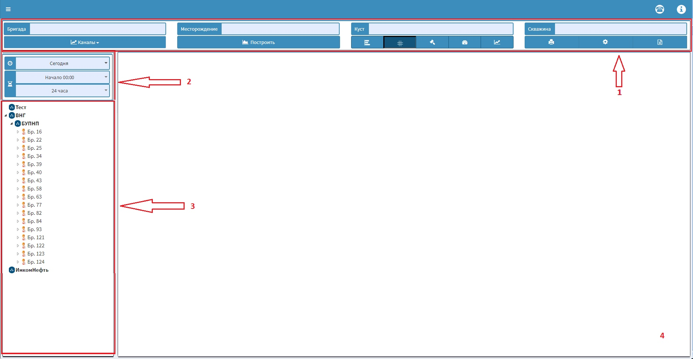

# Тестовое задание

Необходимо разработать Web-приложение, которое позволяет отображать данные о бригаде.

Сценарий страницы: пользователь заходит на страницу, в блоке 2 выбирает день и период, за который построить иерархию бригад в блоке 3, затем в блоке 3 пользователь выбирает бригаду, по которой построить график. После нажатия на бригаду (на рисунке, например, обозначена как "Бр. 16") в блоке 3, в блоке 4 должен отобразиться некоторый график или рисунок.

Задание: отобразить интерфейс, представленный на рисунке:

* Блок 1 – первая линия элементов. Данные о месторождении, кусте, скважине, заполнить случайными данными по умолчанию после запроса графика по бригаде. До запроса поля должны быть пусты
* Блок 1 – вторая линия элементов. До запроса все кнопки должны быть заблокированы. После запроса все кнопки разблокируются. «Каналы» - это выпадающий список, Группа из 5 кнопок – кнопки, которые хранят состояние (нажато/не нажато). Остальные кнопки – кнопки по умолчанию, без каких либо действий
* Блок 2 – все 3 элемента - выпадающие списки. Первый список имеет варианты сегодня/вчера/неделя. Второй список имеет варианты начала просмотра 0/6/12/18/24 часа. Третий список имеет варианты длительности 0/6/12/18/24 часа
* Блок 3 – иерархия, состоящая из подразделений и бригад внутри этих подразделений. При выборе различных временных промежутков в блоке 2 состав иерархии должен изменяться
* Блок 4 – область для отображения графиков или рисунков, разрешается вставлять случайные графики или рисунки для разных бригад и временных промежутков

Технические требования:
1. Приложение должно быть написано на React с использованием Redux
2. Для разработки желательно использовать TypeScript
3. При сборке приложения желательно использовать Webpack, разрешается создать приложение с помощью Create React App
4. Хранить структуры данных в localStorage
5. Исходники предоставить в публичном git-репозитории или в виде архива
